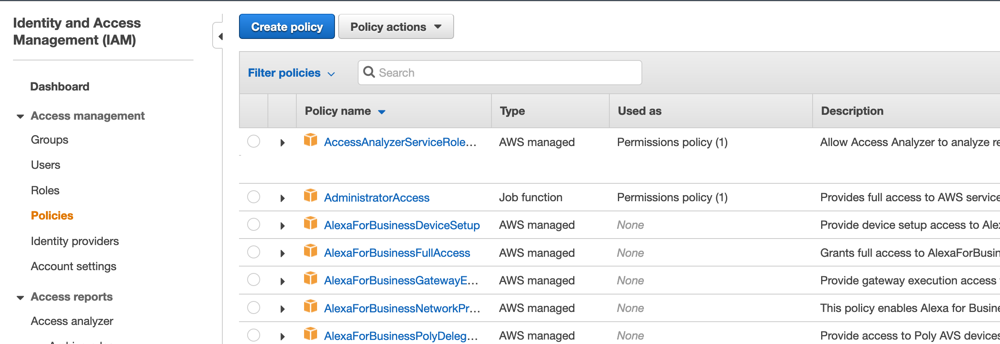
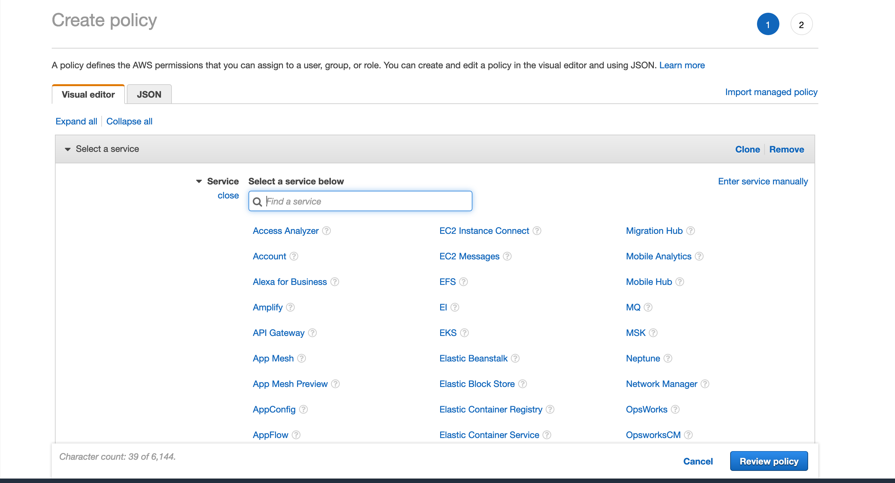

# DevOops: Bad Terraform

Good and bad examples of how to Terraform

## Principles of Good Terraform

* Remote backend with state locking
  * You should use a remote backend like S3 + DynamoDB which supports state locking
  * Enable versioning

* Credentials separate from code
  * Don't put credentials in your provider config
  * Use built in mechanisms like environment variables, path to credentials file, etc

* Configs separate from code
  * Anything that is a parameter should be a declared variable, not hardcoded in your `.tf` files. 
  * Resources with unique name constraints should be scoped to an environment.

* File separation
  * Resources should be grouped in files where it makes sense; don't put everything in a main.tf. 
    * Terraform will flatten it for you but having things logically separated will 

* Reuseable Modules
  * Resources for a use case should be self contained in a Terraform Module and they should be reusable. 
    * Examples of self contained use cases include an application, a reusable database component, or a Jenkins server deployment.
  * Nesting modules is okay when it can logically separate resources

* Decoupled resources
  * Don't rely on nested modules or remote states as this will introduce strong coupling. Use `data` sources where possible.

* Automation
  * Automation scripts to run Terraform - bash or similar
  * CI/CD - Atlantis, TF Cloud

* .gitignore
  * You want to ignore plans, local `.terraform`, etc

## IAM Considerations for Terraform

Overprivileged accounts are a classic threat vector in cloud security. Terraform user accounts are usually heavily overprivileged and sometimes have full admin access. Here are some recommendations to secure Terraform accounts which may be relevant in different scenarios:

* If multiple users interact with Terraform, have them use dedicated Terraform roles that have tightly scoped permissions commensurate to their business needs i.e crafted policies that restrict actions to what they need to use. Users assume those roles to perform actions. 

* Similarly, restrict access to the state file on an as needed basis. A developer IAM role should not access the production state file. This will prevent both accidental issues and malicious actions.

* If using CI/CD, make sure the role policy is tightly scoped and the AssumeRole policy has conditions such as mandating an IP range.

```json
{
  "Version": "2012-10-17",
  "Statement": [
    {
      "Effect": "Allow",
      "Principal": {
        "AWS": "arn:aws:iam::account-id:user/EXAMPLEIAMUSERNAME"
      },
      "Action": "sts:AssumeRole"
    },
    {
      "Effect": "Deny",
      "Principal": {
        "AWS": "arn:aws:iam::account-id:user/EXAMPLEIAMUSERNAME"
      },
      "Action": "sts:AssumeRole",
      "Condition": {
        "NotIpAddress": {
          "aws:SourceIp": [
            "103.15.250.0/24",
            "12.148.72.0/23"
          ]
        }
      }
    }
  ]
}
```

Use the IAM policy creation wizard to save time and validate the template

Open IAM in the console, click on Policies:



Click on Create Policy and use the visual editor. Swap between JSON view to customize or copy it:



## Terraform Examples

Each of these examples mimics a standalone repo. They are based on things I have seen many times when I was doing DevOps consulting. 

### Worst Case Scenario
[Example One](1.worst-case-scenario)

This is basically the worst possible example of Terraform code. Issues with this repo include not having a backend, having all resources in one file, not using modules, not having config files, and not having any automation. Worst of all, it is missing a readme.

Some issues with this kind of configuration include:

* No remote backend
  * Relying on git will eventually cause merge conflicts
  * No state locking can create inconsistent runs

* Single state file
  * State file corruption, loss, or out of band editing is catastrophic. Can be mitigated with git, but not ideal
  * Locking will slow down development for different components or business units
  * State file rollbacks will affect all resources

* Spaghetti
  * Not having configs/variables means declaring multiple sets of resources for environments
  * Hard to read
  * Less operator friendly (can't pass off the module to less experienced people)

* Not reusable
  * Any new resources will need to be added to this file instead of instantiating a new module with a different state file

### Less Bad
[Example Two](2.less-bad)

This example has configs, a remote backend, and some separation, but is still not reusable. 

Some issues with this kind of configuration include:

* Single state file
  * State file corruption, loss, or out of band editing is catastrophic. Can be mitigated with git, but not ideal
  * Locking will slow down development for different components or business units
  * State file rollbacks will affect all resources

* Not super reusable
  * Any new resources will need to be added to this file instead of instantiating a new module with a different state file

### Almost Great
[Example Three](3.almost-great)

This example has configs, a remote backend, separate files, and reusable modules. It has some basic automation which would otherwise require a lot of typing:

```
terraform init \
  -backend-config="environments/staging/frontend/backend.tfvars" \
  -input=false \
  -reconfigure \
  "modules/frontend"

terraform plan \
  -var-file="environments/staging/frontend/terraform.tfvars" \
  -out=./frontend.plan \
  -input=false \
  "modules/frontend"

terraform apply \
    -input=false \
    ./frontend.plan
```

However, there is no region or multi-cloud support.

### You Made It
[Example Four](4.you-made-it)

This example has all of the good principles and also has multi-region, multi-cloud support with full automation to simplify and speed up running Terraform. You can put this in a CI/CD pipeline or run it locally. 

Each item under `/$cloud/$region/$environment` is called a `component`. This component can be anything that fits into a Terraform module such as a staging RDS database or a module that creates an S3 bucket, a Cloudfront distribution, and some R53 records.

This example supports arbitrary clouds, environments, regions, and modules. It will handle `init` per component, have separate `state` per component, and handle `plan` and `apply` programmatically. It can easily be extended to support any other functionality.

The readme discusses the modules and environments that exist in the repo and it explains how to use the script.

